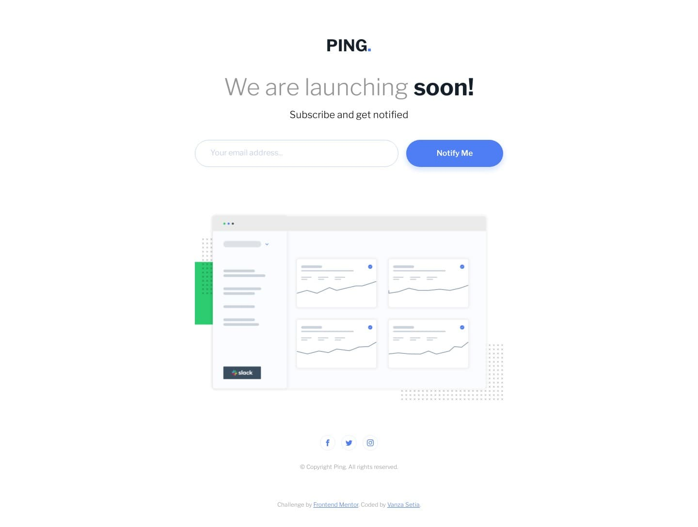

# Ping Single Column Coming Soon Page

## Disclaimer

This project is solely for learning purposes. I take no any responsibility or liability for the accuracy, completeness, or usefulness of any information provided in this project. You should not use it as a reference for creating your project.

I am currently no longer working on this project.

## Overview

### Introduction

Welcome to the `README.md` of this repo! The purpose of creating this project is to sharpen my coding skill.

In this file I'm going to tell you everything, starting from tools that I used, and much more.

That's it for the introduction and **happy reading!**

### The Challenge

My challenge is to build out this Coming Soon page and get it looking as close to the design as possible.

My users should be able to:

- View the optimal layout for the site depending on their device's screen size
- See hover states for all interactive elements on the page
- Submit their email address using an input field
- Receive an error message when the form is submitted if:
  - The input field is empty
  - The email address is not formatted correctly

### Links

- [Live Review](https://pingonline.netlify.app/)
- [Frontend Mentor Solution Page](https://www.frontendmentor.io/solutions/ping-single-column-coming-soon-page-html-css-sass-javascript-67lHHLX6N)

### Screenshots

## My Process

### Built With

- **Following best practices**\* 
- HTML Semantic Tags
- [BEM (Block, Element, Modifier)](https://sparkbox.com/foundry/bem_by_example) Class *Naming Convention*
- [Sass](https://sass-lang.com/)
- JavaScript
- CSS Flexbox
- Mobile-first workflow

> \* I follow guidelines. [See what guidelines that I follow.](./docs/README.md#guidelines)

### Useful Resources

- [Get you <head> straight](https://youtu.be/MHyAOZ45vnU) - It's a YouTube video where Harry Roberts ([@csswizardry](https://github.com/csswizardry)) tells the optimum order for the meta tags so that the site can load as soon as possible.

## License

This project is licensed under the terms of [the MIT license](./LICENSE).

## References

See the [documentation.](./docs/README.md)
